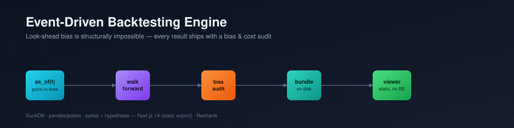
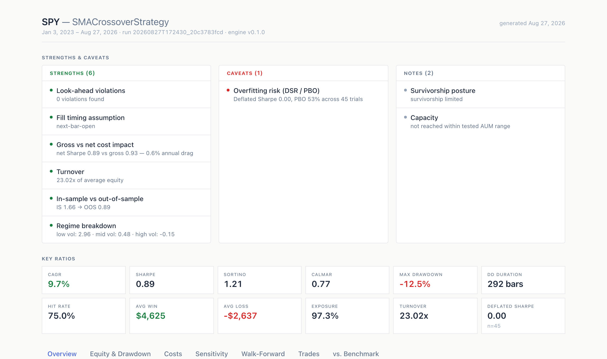
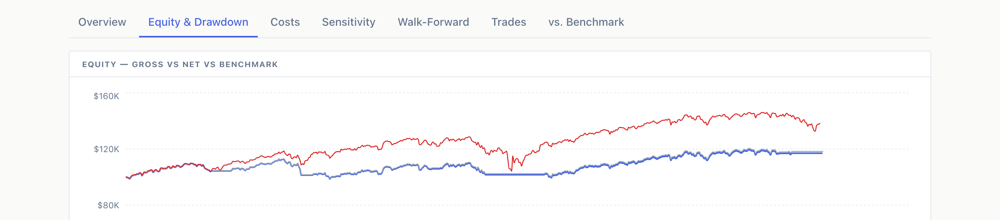
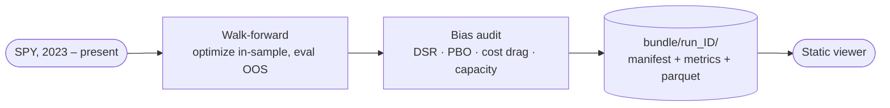
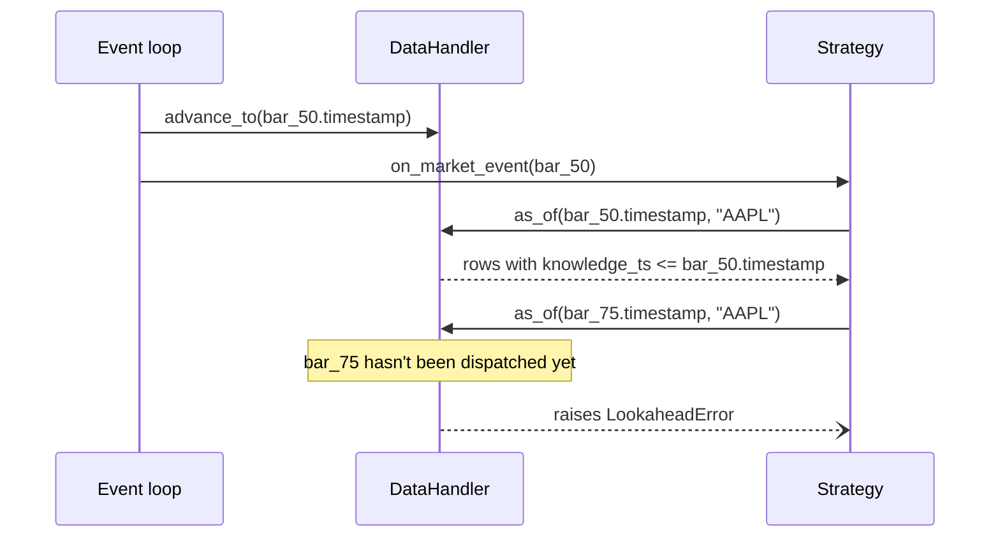
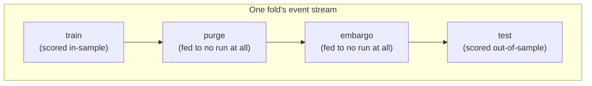

<p align="center">
  
</p>

<p align="center">
  
  
  
  
  
  <a href="LICENSE"></a>
</p>

<p align="center"><b>A backtesting engine where look-ahead bias is structurally impossible to introduce — not avoided by convention, but blocked by the data-access interface itself.</b></p>

---

The engine replays market data through a time-ordered event queue (`MarketEvent` →
`SignalEvent` → `OrderEvent` → `FillEvent`) against a point-in-time DuckDB store, walk-forward
optimizes a strategy's parameters with purging and embargo between train and test, and audits its
own result for the biases that usually go unmeasured — Deflated Sharpe Ratio, Probability of
Backtest Overfitting, gross-vs-net cost drag, capacity. Everything lands in one immutable,
versioned bundle on disk, which a static Next.js viewer renders as a report — no backend, no
database connection, no Python import anywhere in the frontend.

This is a standalone portfolio project, not tied to any specific fund or product. It was built to
demonstrate that the invariants a backtesting engine actually needs — no look-ahead, no same-bar
fills, no unaudited parameter search — can be enforced by what an interface is capable of
returning, the same discipline as a type system, rather than left to code-review vigilance.

## Contents

- [Why this exists](#why-this-exists)
- [Screenshots](#screenshots)
- [Installation](#installation)
- [Quickstart](#quickstart)
- [The no-look-ahead invariant](#the-no-look-ahead-invariant)
- [Walk-forward: purge + embargo](#walk-forward-purge--embargo)
- [The bias audit](#the-bias-audit)
- [Design principles](#design-principles)
- [Bundle contract](#bundle-contract)
- [Tech stack](#tech-stack)
- [Development](#development)
- [Deploy](#deploy)
- [Disclaimer](#disclaimer)

## Why this exists

Most backtests fail quietly, in the plumbing rather than the strategy logic:

- **A signal that can see tomorrow's close** — because nothing stopped it from querying past the
  current bar, it just happened not to (until it does).
- **A fill priced on the same bar that generated the order** — because the loop's call order
  happened to prevent it, not because the fill handler would refuse it if that order changed.
- **A Sharpe ratio quietly inflated by search** — the best of 50 parameter combinations, reported
  as if it were the only one tried.
- **Transaction costs treated as an afterthought** — a flat bps haircut applied at the end, instead
  of itemized commission/spread/impact that a strategy's own trades feed back into.

Each of those is a *convention* in most backtesting code: something the author intends to always
do correctly, enforced by nothing but care. This engine tries to turn each one into a *structural*
guarantee instead — the interface a strategy is handed simply cannot return future data, the
execution handler simply cannot fill an order on the bar that produced it, and the report format
puts the overfitting-corrected Sharpe next to the raw one instead of hiding it in an appendix.

It is **not** a trading platform: no live order routing, no broker integration, no cloud
deployment of the engine itself. Everything runs locally against cached data; the only thing that
ever leaves your machine is the static viewer.

## Screenshots

**Overview — Strengths/Caveats box driven by the bias audit, and the metrics grid**



**Equity & Drawdown — gross vs. net vs. buy-and-hold benchmark**



## Installation

```bash
git clone https://github.com/divyaanshkumar24/event-driven-backtesting-engine.git
cd event-driven-backtesting-engine

# Compute engine
make venv          # creates .venv (python3.11) and installs with dev extras

# Viewer
cd viewer && npm install
```

## Quickstart



```bash
# 1. Run the reference strategy end-to-end on real data (fetches & caches SPY via yfinance,
#    walk-forward optimizes, audits, writes a bundle + viewer data)
.venv/bin/python scripts/run_reference_backtest.py

# 2. View the report
cd viewer && npm run dev
```

Open `http://localhost:3000`. `scripts/run_reference_backtest.py` is a thin composition of the
same public functions used by the tests — `run_walk_forward`, `build_bias_audit`,
`compute_metrics`, `write_bundle` — wiring your own strategy in means writing a `Strategy` (one
method: `on_market_event(event, data) -> SignalEvent | None`) and pointing that same pipeline at it.

## The no-look-ahead invariant

`DataHandler.as_of(t, symbol)` is the *only* data-access path a strategy is ever given. It's bound
to a replay clock that only the event loop advances, in step with the bars actually being
dispatched — asking it for anything past that clock doesn't return stale or empty data, it raises:



```python
def as_of(self, t, symbol):
    if self._current_time is None:
        raise LookaheadError("replay clock has not started")
    if t > self._current_time:
        raise LookaheadError(f"requested t={t} is beyond the current replay clock")
    return self._store.query_as_of(symbol, t)
```

This is proven, not just asserted: a Hypothesis property test checks that the underlying store
query never returns a row with `knowledge_ts` after `t`, for randomized data and random `t`; a
"leak canary" test has a fake strategy try to peek past the replay clock and asserts it raises. The
same pattern extends to fills — `ExecutionHandler` raises `SameBarFillError` if an order's
timestamp isn't strictly before the bar it's matched against.

## Walk-forward: purge + embargo

Rolling or anchored folds, with each test window starting exactly `test_bars` after the previous
one ends — no independent step size, so out-of-sample segments are adjacent by construction, never
overlapping or gapped. Purge and embargo close the two subtler leaks a naive walk-forward split
is prone to at the train/test boundary:



The in-sample optimization run's event queue is *bounded* to end at the purge boundary — the
DataHandler's replay clock never advances past it, so `as_of()` calls during that run cannot see
embargo- or test-period data through any path, structurally, not by filtering results afterward.
Verified by running two datasets that are identical up through the purge boundary but diverge
sharply afterward, and asserting the in-sample parameter selection is byte-identical between them.

## The bias audit

`bias_audit.json` reports nine fields, each as `{status, value, explanation}` — from a real run
against SPY:

```json
{
  "overfitting_analysis": {
    "status": "warn",
    "value": {
      "n_param_combos_tested_per_fold": 9,
      "n_folds": 5,
      "deflated_sharpe": { "dsr": 0.0, "observed_sharpe": 0.056, "n_trials": 45 },
      "pbo": { "pbo": 0.529, "n_combinations": 70, "n_splits": 8 }
    },
    "explanation": "deflated_sharpe corrects the stitched OOS Sharpe for having tried 45 param combinations pooled across all folds (a conservative count of the full multiple-testing exposure). pbo is computed via CSCV on the last fold's per-combo in-sample return matrix."
  }
}
```

A net Sharpe of 0.89 looks reasonable on its own — this field is what stops it from being reported
uncorrected: once deflated for the 45 parameter combinations actually tried across folds, the
Deflated Sharpe Ratio drops to 0.0, and the Probability of Backtest Overfitting sits at 53%, close
to a coin flip. The other eight fields cover look-ahead violation count (0, by construction — a
violation would have raised and aborted the run), the fill-timing assumption, survivorship posture,
gross-vs-net cost drag and breakeven cost multiple, turnover, in-sample-vs-OOS degradation, a
volatility-regime Sharpe breakdown, and capacity (the AUM at which the strategy's own market impact
would erode its edge to zero).

The Deflated Sharpe Ratio and PBO implementations are tested against synthetic scenarios with known
ground truth — a "lucky winner" among 50 pure-noise trials is correctly *not* endorsed once
corrected for the 50 trials tried, and a panel of genuinely-noise strategies correctly produces a
high PBO, while one with a persistent real edge produces a low one.

## Design principles

**Structural over conventional.** Every invariant above (no look-ahead, no same-bar fills, no
boundary leakage) is enforced by what an interface *can* return, not by a rule a future change
could quietly violate. `DataHandler` has no method that could hand back future data; there's
nothing to remember not to call.

**Test-first for timing.** Anything touching data timing or fills got its leak-canary or property
test written before or alongside the implementation, not after — `tests/data/`,
`tests/execution/`, and `tests/walkforward/` read as a list of specific ways a backtest can lie,
each with a test proving this engine can't do that particular one.

**Ask before assuming.** Fill convention, adjustment handling (raw prices and split/dividend
factors in separate tables, never a back-adjusted-only series), position sizing, delisting
handling, purge/embargo semantics — each of these is a genuine, contestable finance decision with
more than one defensible answer, confirmed explicitly rather than silently defaulted.

**Local-first.** No cloud services, no live trading, no order routing. Price data is cached to a
local DuckDB file; there are zero network calls inside the event loop itself, only in the
ingestion step that runs before a backtest starts.

**The viewer never imports Python.** The compute engine and the report viewer are joined only by
an immutable bundle on disk. The viewer is a static site — it deploys the same way whether that
bundle came from a laptop or a scheduled job, and it has nothing to talk to at runtime.

## Bundle contract

There's no REST API — the contract is six files in `bundles/run_<id>/`:

| File | Shape | Purpose |
|---|---|---|
| `manifest.json` | inputs, a sha256 hash of the exact price rows used, engine version, timestamp | reproducibility — two runs are diffable |
| `metrics.json` | CAGR, Sharpe, Sortino, Calmar, max DD (+duration), hit rate, avg win/loss, exposure, turnover, deflated Sharpe, gross-vs-net | the full performance metric set |
| `equity.parquet` | `timestamp, equity` | the stitched out-of-sample equity curve |
| `trades.parquet` | `timestamp, symbol, quantity, fill_price, commission, half_spread, impact` | every OOS fill, cost-itemized |
| `sensitivity.json` | Sharpe vs. parameter grid, Sharpe vs. rebalance frequency | the sensitivity panels the viewer renders as a heatmap |
| `bias_audit.json` | nine `{status, value, explanation}` fields | the audit described above |

`write_bundle(...)` refuses to overwrite an existing `run_id` — bundles are immutable; re-running
produces a new one instead. Two things the viewer additionally needs — a full gross equity curve
and a buy-and-hold benchmark curve — aren't in this contract (only their summary stats are); they're
derived at export time by `engine/bundle/viewer_export.py` from the same in-memory run, so the
bundle format above stays exactly six files.

## Tech stack

<p>
  
  
  
  
  
  
  
  
</p>

**event-driven-simulation · point-in-time-data · walk-forward-optimization ·
deflated-sharpe-ratio · combinatorial-purged-cross-validation · transaction-cost-modeling ·
static-site-reporting**

## Development

```bash
make test    # pytest — 94 tests: property tests, leak canaries, synthetic-overfit stats, ...
make lint    # ruff check

cd viewer && npm run build   # type-check + static export
```

## Deploy

Only `viewer/` is ever deployed — `engine/`, `bundles/`, and `data_cache/` stay local, by design.

1. Import this repo into Vercel and set **Root Directory** to `viewer`.
2. Leave the build command as `next build` (the default) and install command as `npm install`. No
   environment variables are required.
3. `viewer/public/data/current/` — the JSON snapshot from a real run — is committed so the deployed
   demo has something to show; it's derived output, not source, but shipped intentionally for the
   public demo (see `engine/bundle/viewer_export.py`). Regenerate it with
   `scripts/run_reference_backtest.py` and redeploy to update the demo.

Live demo: **[event-driven-backtesting-engine.vercel.app](https://event-driven-backtesting-engine.vercel.app)**

## Disclaimer

This is a portfolio/engineering project, not investment software. The reference strategy (SMA
crossover) is deliberately trivial — it exists only to exercise the event loop — and its
walk-forward result is not a recommendation; the bundle's own bias audit flags it as not surviving
correction for the parameter search that produced it. Nothing here is investment advice.

## License

MIT — see [LICENSE](LICENSE).
